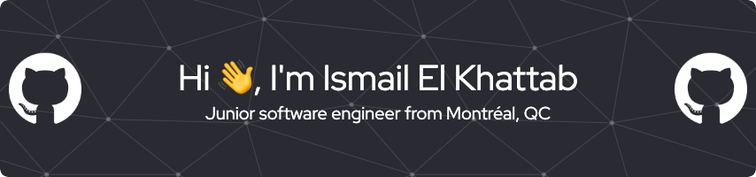

# About me

- 👨‍💻 My best projects are available at **www.ismailelkhattab.dev**

- 🎓 B.S. Software Development **@ Western Governor's University**

- 📍 Located in **Canada**

- 🌱 I’m currently learning **React Native**

- 📫 How to reach me **ielkhat@wgu.edu**

# Connect with me: 

  
  

# Languages and Tools:

 

  

------
